```{=html}
<div class="page-single">
  <div class="content">

    <section class="section reveal">
      <div class="section-label">Data</div>
      <p class="data-intro">This page is a display window for some of the datasets I have worked on (with some amazing coauthors) across my projects. If you need any information, especially about the unpublished datasets, please feel free to contact me!</p>

      <article class="dataset">
        <h3 class="dataset-title">ROAD to Democracy: A Global Dataset of Overturning Attempts and Organizations in Civil Resistance Transitions</h3>
        <p class="dataset-desc">The project identifies overturning attempts as part of civil resistance transitions: who tried to take the win back, how, and whether they succeeded. It covers 68 transitions in 61 countries between 1974 and 2018, and yields 86 attempts, nine of which reversed the transition.</p>

        <div class="views" tabindex="0" role="group" aria-label="ROAD views">
          <button class="view-nav prev" type="button" aria-label="Previous view"><svg viewBox="0 0 24 24" fill="none" stroke="currentColor" stroke-width="2.5" stroke-linecap="round" stroke-linejoin="round"><polyline points="15 18 9 12 15 6"/></svg></button>
          <div class="view-stage">
            <div class="view-panel is-active">
              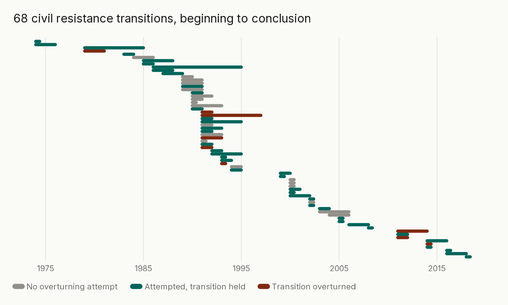
              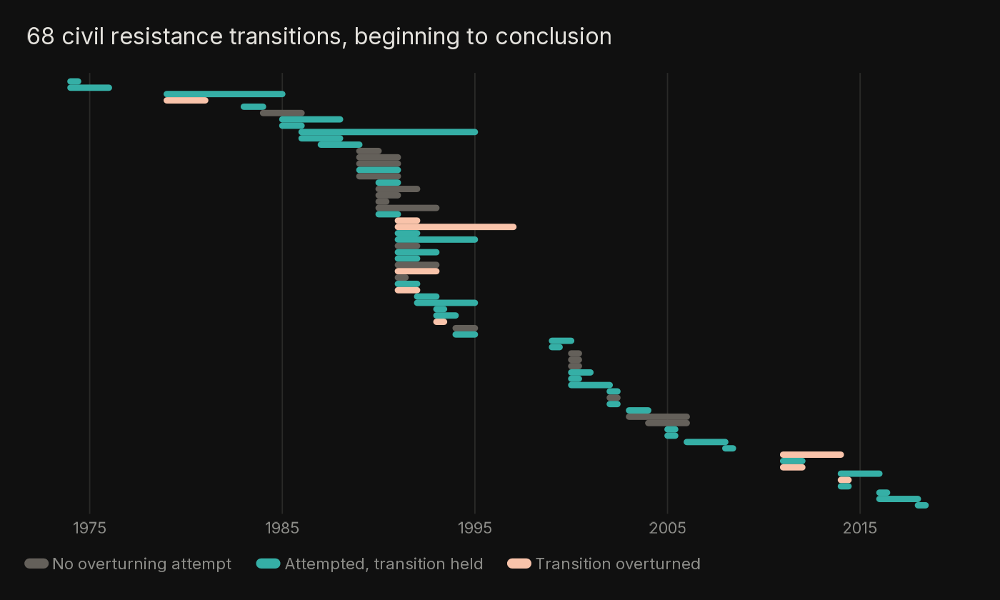
            </div>
            <div class="view-panel">
              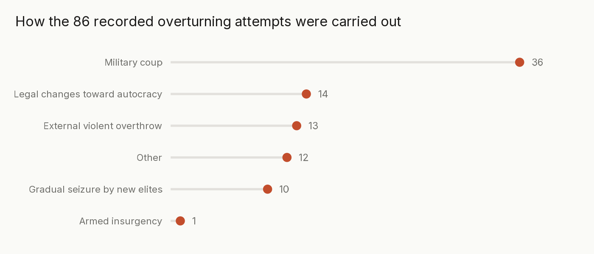
              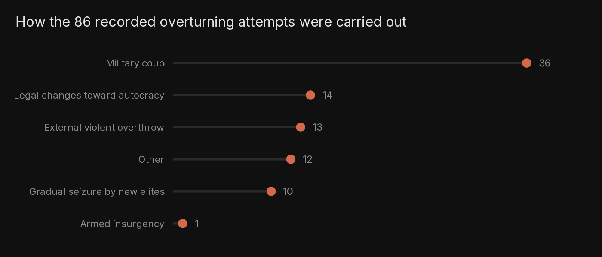
            </div>
            <div class="view-panel">
              <div class="data-table-wrap">
                <table class="data-table">
                  <caption>The nine reversals</caption>
                  <thead><tr><th>Country</th><th>Transition</th><th>How it fell</th></tr></thead>
                  <tbody>
                    <tr><td class="term">Iran</td><td class="num">1979&ndash;1981</td><td>Legal changes toward autocracy</td></tr>
                    <tr><td class="term">Niger</td><td class="num">1991&ndash;1993</td><td>Military coup</td></tr>
                    <tr><td class="term">Albania</td><td class="num">1991&ndash;1992</td><td>Gradual seizure by new elites</td></tr>
                    <tr><td class="term">Zambia</td><td class="num">1991&ndash;1992</td><td>Gradual seizure by new elites</td></tr>
                    <tr><td class="term">Belarus</td><td class="num">1991&ndash;1997</td><td>Legal changes toward autocracy</td></tr>
                    <tr><td class="term">Nigeria</td><td class="num">1993</td><td>Military coup</td></tr>
                    <tr><td class="term">Egypt</td><td class="num">2011&ndash;2014</td><td>Military coup</td></tr>
                    <tr><td class="term">Yemen</td><td class="num">2011&ndash;2012</td><td>External violent overthrow</td></tr>
                    <tr><td class="term">Thailand</td><td class="num">2014</td><td>Military coup</td></tr>
                  </tbody>
                </table>
              </div>
            </div>
          </div>
          <button class="view-nav next" type="button" aria-label="Next view"><svg viewBox="0 0 24 24" fill="none" stroke="currentColor" stroke-width="2.5" stroke-linecap="round" stroke-linejoin="round"><polyline points="9 18 15 12 9 6"/></svg></button>
          <div class="view-foot">
            <span class="view-dots">
              <button class="view-dot is-active" type="button" aria-label="View 1"></button>
              <button class="view-dot" type="button" aria-label="View 2"></button>
              <button class="view-dot" type="button" aria-label="View 3"></button>
            </span>
          </div>
        </div>
      </article>

      <article class="dataset">
        <h3 class="dataset-title">Identifying Overturning Organizations in Civil Resistance Transitions</h3>
        <p class="dataset-desc">A continuation of the ROAD project, where we collected further data on the specific organizations involved in each campaign. Every organization is traced into the transition that followed and coded on what it is, how big it is, its ideology, whether it led the campaign, what office it took afterward, and how close it had been to the regime that fell. 303 organizations, 54 transitions, 48 countries.</p>

        <div class="views" tabindex="0" role="group" aria-label="Successor organizations views">
          <button class="view-nav prev" type="button" aria-label="Previous view"><svg viewBox="0 0 24 24" fill="none" stroke="currentColor" stroke-width="2.5" stroke-linecap="round" stroke-linejoin="round"><polyline points="15 18 9 12 15 6"/></svg></button>
          <div class="view-stage">
            <div class="view-panel is-active">
              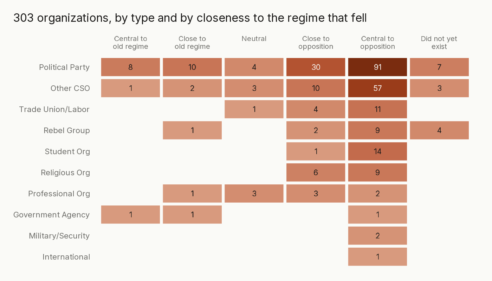
              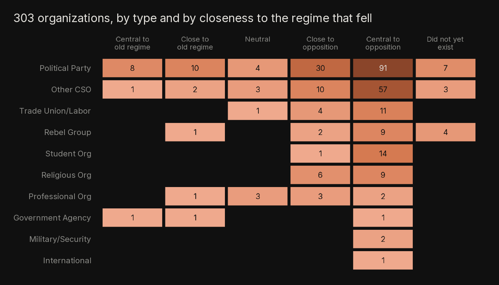
            </div>
            <div class="view-panel">
              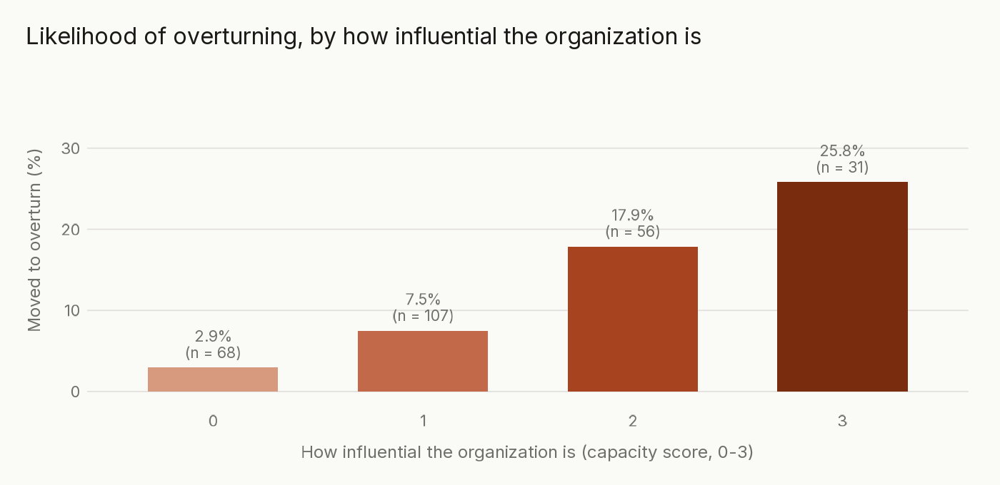
              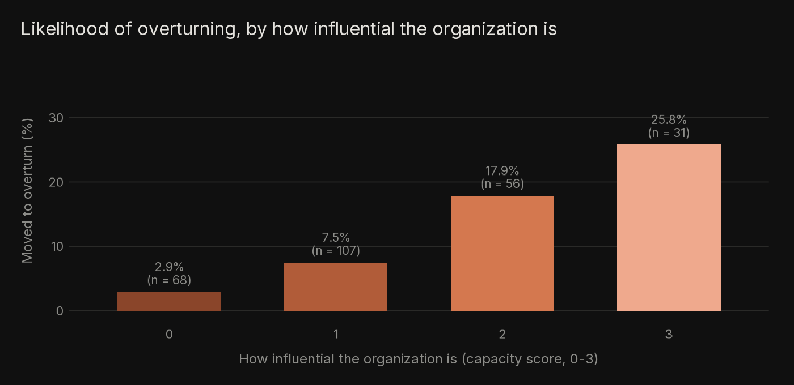
            </div>
          </div>
          <button class="view-nav next" type="button" aria-label="Next view"><svg viewBox="0 0 24 24" fill="none" stroke="currentColor" stroke-width="2.5" stroke-linecap="round" stroke-linejoin="round"><polyline points="9 18 15 12 9 6"/></svg></button>
          <div class="view-foot">
            <span class="view-dots">
              <button class="view-dot is-active" type="button" aria-label="View 1"></button>
              <button class="view-dot" type="button" aria-label="View 2"></button>
            </span>
          </div>
        </div>
      </article>

      <article class="dataset">
        <h3 class="dataset-title">The Interest in BRICS Accession Dataset</h3>
        <p class="dataset-desc">In the context of the last waves of participation in the BRICS, we systematically coded every country in the world for whether it officially expressed interest in the group and when. Interest counts only on a statement by a head of state, foreign minister, or designated spokesperson, or when the bloc itself names the country. 195 states, 60 of them interested, through the end of 2024.</p>

        <div class="views" tabindex="0" role="group" aria-label="BRICS views">
          <button class="view-nav prev" type="button" aria-label="Previous view"><svg viewBox="0 0 24 24" fill="none" stroke="currentColor" stroke-width="2.5" stroke-linecap="round" stroke-linejoin="round"><polyline points="15 18 9 12 15 6"/></svg></button>
          <div class="view-stage">
            <div class="view-panel is-active">
              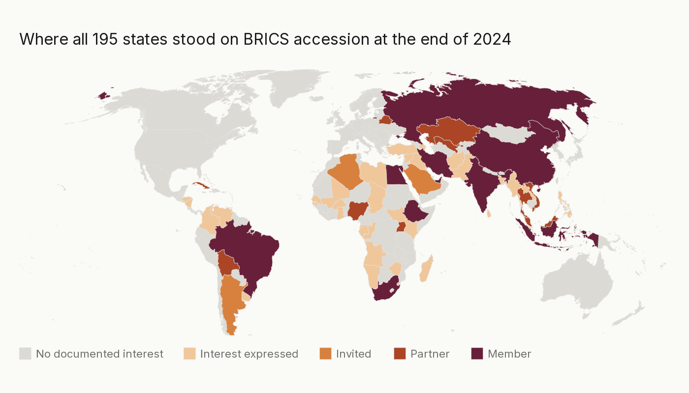
              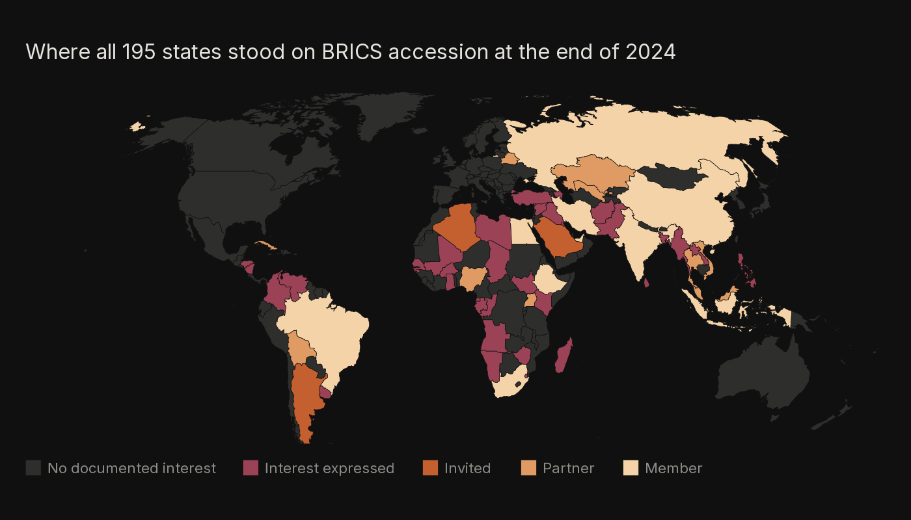
            </div>
            <div class="view-panel">
              <div class="data-table-wrap">
                <table class="data-table">
                  <caption>The 60 interested states, by tier</caption>
                  <thead><tr><th>Tier</th><th>N</th><th>States</th></tr></thead>
                  <tbody>
                    <tr><td class="term">Member</td><td class="num">10</td><td class="list">Brazil, China, Egypt, Ethiopia, India, Indonesia, Iran, Russia, South Africa, United Arab Emirates</td></tr>
                    <tr><td class="term">Partner</td><td class="num">10</td><td class="list">Belarus, Bolivia, Cuba, Kazakhstan, Malaysia, Nigeria, Thailand, Uganda, Uzbekistan, Vietnam</td></tr>
                    <tr><td class="term">Invited</td><td class="num">3</td><td class="list">Algeria, Argentina, Saudi Arabia</td></tr>
                    <tr><td class="term">Interest only</td><td class="num">37</td><td class="list">Afghanistan, Angola, Azerbaijan, Bahrain, Bangladesh, Burkina Faso, Chad, Colombia, Republic of the Congo, Equatorial Guinea, Gabon, The Gambia, Ghana, Guinea-Bissau, Honduras, Iraq, Kenya, Kuwait, Laos, Libya, Madagascar, Mali, Myanmar, Namibia, Nicaragua, Pakistan, Palestine, Philippines, Senegal, South Sudan, Sri Lanka, Eswatini, Syria, T&uuml;rkiye, Uruguay, Venezuela, Zimbabwe</td></tr>
                  </tbody>
                </table>
              </div>
            </div>
            <div class="view-panel">
              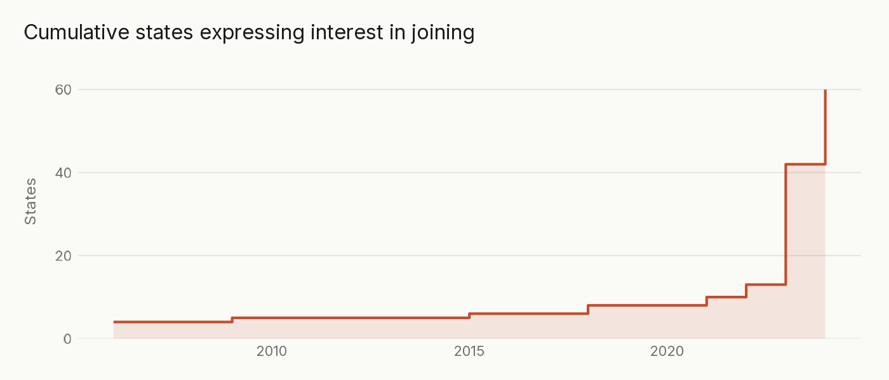
              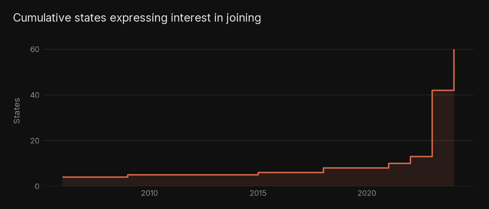
            </div>
          </div>
          <button class="view-nav next" type="button" aria-label="Next view"><svg viewBox="0 0 24 24" fill="none" stroke="currentColor" stroke-width="2.5" stroke-linecap="round" stroke-linejoin="round"><polyline points="9 18 15 12 9 6"/></svg></button>
          <div class="view-foot">
            <span class="view-dots">
              <button class="view-dot is-active" type="button" aria-label="View 1"></button>
              <button class="view-dot" type="button" aria-label="View 2"></button>
              <button class="view-dot" type="button" aria-label="View 3"></button>
            </span>
          </div>
        </div>
      </article>

      <article class="dataset">
        <h3 class="dataset-title">From Loyalty to Exit: Why Regime Support Groups Defect during Civil Resistance</h3>
        <p class="dataset-desc">An ongoing project on defections from the ruling coalition. Fourteen support groups are tracked year by year across authoritarian and backsliding regimes, each coded for how unified its support is and how intense its loyalty. The two views below are a window into what we did; the data will be able to show far more. This is still a WIP, stay tuned for updates!</p>

        <div class="views" tabindex="0" role="group" aria-label="Defections views">
          <button class="view-nav prev" type="button" aria-label="Previous view"><svg viewBox="0 0 24 24" fill="none" stroke="currentColor" stroke-width="2.5" stroke-linecap="round" stroke-linejoin="round"><polyline points="15 18 9 12 15 6"/></svg></button>
          <div class="view-stage">
            <div class="view-panel is-active">
              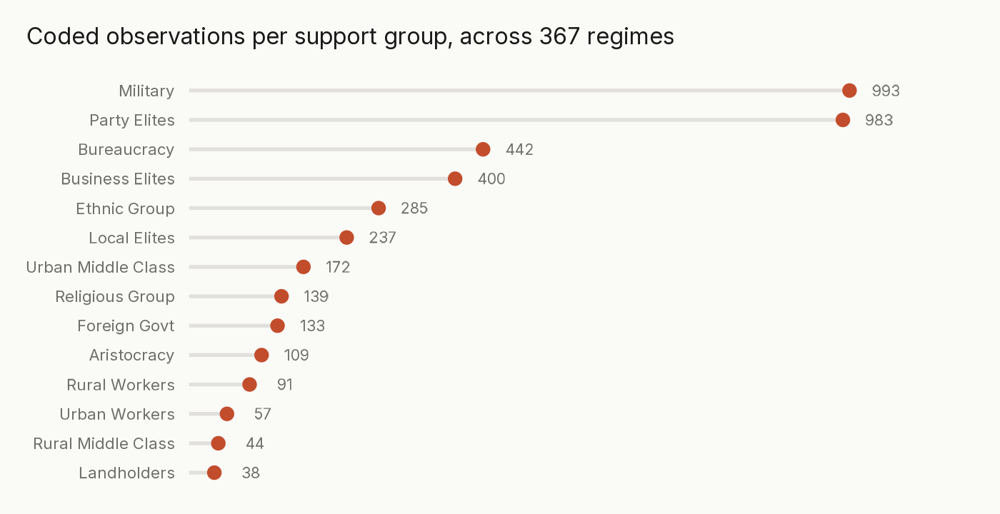
              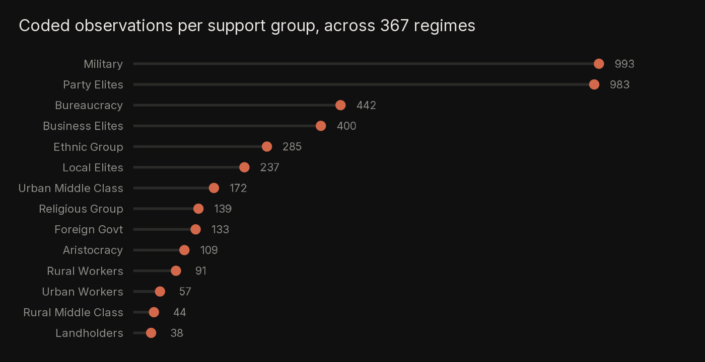
            </div>
            <div class="view-panel">
              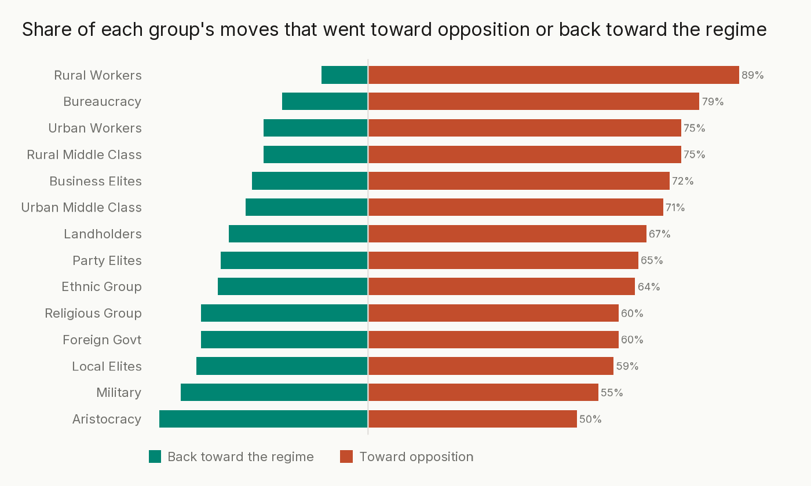
              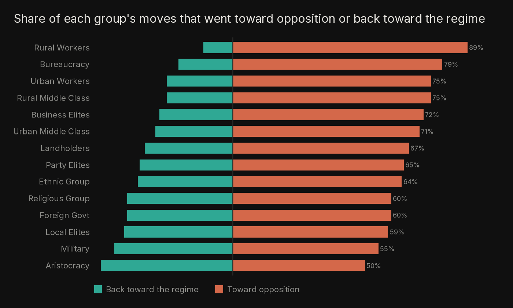
            </div>
          </div>
          <button class="view-nav next" type="button" aria-label="Next view"><svg viewBox="0 0 24 24" fill="none" stroke="currentColor" stroke-width="2.5" stroke-linecap="round" stroke-linejoin="round"><polyline points="9 18 15 12 9 6"/></svg></button>
          <div class="view-foot">
            <span class="view-dots">
              <button class="view-dot is-active" type="button" aria-label="View 1"></button>
              <button class="view-dot" type="button" aria-label="View 2"></button>
            </span>
          </div>
        </div>
      </article>

    </section>

  </div>
</div>

<footer>
  <p class="footer-text"><a class="pub-link" href="mailto:Giuseppe.Peressotti@utdallas.edu">Contact me</a> &middot; &copy; 2026 Giuseppe Peressotti</p>
</footer>
```
