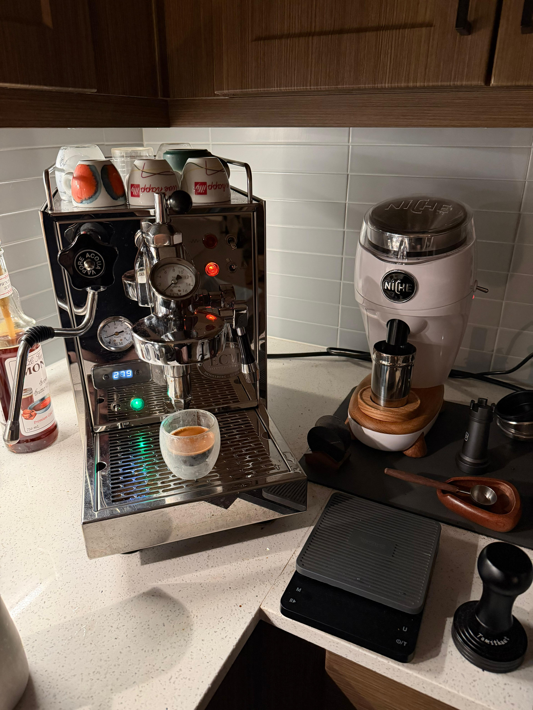

```{=html}
<div class="page-single">

  <!-- ── Header (centered, elegant) ── -->
  <header class="header reveal">
    
    <h1 class="header-name">Giuseppe Peressotti</h1>
    <p class="header-subtitle">PhD Candidate in Public Policy &amp; Political Economy</p>
    <p class="header-institution">The University of Texas at Dallas</p>
    <span class="header-market">On the 2026–2027 Job Market</span>

    <div class="header-links">
      <a href="mailto:peressotti.giuseppe@gmail.com">
        <svg viewBox="0 0 16 16" fill="currentColor"><path d="M.05 3.555A2 2 0 0 1 2 2h12a2 2 0 0 1 1.95 1.555L8 8.414.05 3.555ZM0 4.697v7.104l5.803-3.558L0 4.697ZM6.761 8.83l-6.57 4.027A2 2 0 0 0 2 14h12a2 2 0 0 0 1.808-1.144l-6.57-4.027L8 9.586l-1.239-.757Zm3.436-.586L16 11.801V4.697l-5.803 3.546Z"/></svg>
        Email
      </a>
      <a href="https://scholar.google.com/citations?user=qdYq504AAAAJ&hl=en&oi=ao" target="_blank" rel="noopener">
        <svg viewBox="0 0 16 16" fill="currentColor"><path d="M8.211 2.047a.5.5 0 0 0-.422 0l-7.5 3.5a.5.5 0 0 0 .025.917l7.5 3a.5.5 0 0 0 .372 0L14 7.14V13a1 1 0 0 0-1 1v2h3v-2a1 1 0 0 0-1-1V6.739l.686-.275a.5.5 0 0 0 .025-.917l-7.5-3.5Z"/><path d="M4.176 9.032a.5.5 0 0 0-.656.327l-.5 1.7a.5.5 0 0 0 .294.605l4.5 1.8a.5.5 0 0 0 .372 0l4.5-1.8a.5.5 0 0 0 .294-.605l-.5-1.7a.5.5 0 0 0-.656-.327L8 10.466 4.176 9.032Z"/></svg>
        Scholar
      </a>
      <a href="https://github.com/GiuseppePeressotti" target="_blank" rel="noopener">
        <svg viewBox="0 0 16 16" fill="currentColor"><path d="M8 0C3.58 0 0 3.58 0 8c0 3.54 2.29 6.53 5.47 7.59.4.07.55-.17.55-.38 0-.19-.01-.82-.01-1.49-2.01.37-2.53-.49-2.69-.94-.09-.23-.48-.94-.82-1.13-.28-.15-.68-.52-.01-.53.63-.01 1.08.58 1.23.82.72 1.21 1.87.87 2.33.66.07-.52.28-.87.51-1.07-1.78-.2-3.64-.89-3.64-3.95 0-.87.31-1.59.82-2.15-.08-.2-.36-1.02.08-2.12 0 0 .67-.21 2.2.82.64-.18 1.32-.27 2-.27.68 0 1.36.09 2 .27 1.53-1.04 2.2-.82 2.2-.82.44 1.1.16 1.92.08 2.12.51.56.82 1.27.82 2.15 0 3.07-1.87 3.75-3.65 3.95.29.25.54.73.54 1.48 0 1.07-.01 1.93-.01 2.2 0 .21.15.46.55.38A8.013 8.013 0 0 0 16 8c0-4.42-3.58-8-8-8z"/></svg>
        GitHub
      </a>
      <a href="https://www.linkedin.com/in/giuseppe-peressotti-57b6a614b/" target="_blank" rel="noopener">
        <svg viewBox="0 0 16 16" fill="currentColor"><path d="M0 1.146C0 .513.526 0 1.175 0h13.65C15.474 0 16 .513 16 1.146v13.708c0 .633-.526 1.146-1.175 1.146H1.175C.526 16 0 15.487 0 14.854V1.146zm4.943 12.248V6.169H2.542v7.225h2.401zm-1.2-8.212c.837 0 1.358-.554 1.358-1.248-.015-.709-.52-1.248-1.342-1.248-.822 0-1.359.54-1.359 1.248 0 .694.521 1.248 1.327 1.248h.016zm4.908 8.212V9.359c0-.216.016-.432.08-.586.173-.431.568-.878 1.232-.878.869 0 1.216.662 1.216 1.634v3.865h2.401V9.25c0-2.22-1.184-3.252-2.764-3.252-1.274 0-1.845.7-2.165 1.193v.025h-.016a5.54 5.54 0 0 1 .016-.025V6.169h-2.4c.03.678 0 7.225 0 7.225h2.4z"/></svg>
        LinkedIn
      </a>
      <a href="https://bsky.app/profile/gperessotti.bsky.social" target="_blank" rel="noopener" aria-label="Bluesky">
        <svg viewBox="0 0 600 530" fill="currentColor"><path d="M135.72 44.03c66.5 49.92 138.02 151.14 164.28 205.46 26.26-54.32 97.78-155.54 164.28-205.46 47.99-36.02 125.72-63.87 125.72 24.85 0 17.72-10.16 148.79-16.12 170.07-20.73 73.98-96.16 92.83-163.27 81.42 117.3 19.95 147.14 86.07 82.71 152.2-122.39 125.59-175.91-31.5-189.63-71.76-2.51-7.38-3.69-10.83-3.69-7.9 0-2.93-1.18.52-3.69 7.9-13.72 40.26-67.24 197.35-189.63 71.76-64.43-66.13-34.59-132.25 82.71-152.2-67.11 11.41-142.54-7.43-163.27-81.42-5.96-21.28-16.12-152.35-16.12-170.07 0-88.72 77.73-60.87 125.72-24.85z"/></svg>
        Bluesky
      </a>
    </div>
  </header>

  <div class="content">

    <!-- About -->
    <section class="section reveal">
      <div class="section-label">About</div>
      <div class="about-text">
        <p>I am a PhD Candidate in Public Policy and Political Economy at the University of Texas at Dallas. My research in International Political Economy relates to the design of preferential trade agreements, the diffusion of digital provisions through trade policy, and the role of regionalism and international organizations in shaping digital governance. I also study institutional change, political conflict, and democratic backsliding, linking political economy to regime dynamics and coalition formation. My work has been published in the <em>European Journal of International Relations</em> and the <em>Journal of Peace Research</em>.</p>
        <p>At UT Dallas I have served as instructor of record for four undergraduate courses: International Relations, Political Economy of East Asia, Research Design in the Social Sciences, and International Trade Policy, the last of which I designed from the ground up.</p>
        <p>Before starting my PhD, I completed a Master of International Studies in International Trade from Sogang University (Seoul, South Korea), and my BA in East Asian Studies from Ca' Foscari University of Venice.</p>
        <p>In my spare time I enjoy lifting weights, go for a hike (sigh for living in Dallas...) and nerd out on my amazing espresso setup at home.</p>
        <figure class="espresso-figure">
          
          <figcaption>My aforementioned home-espresso station</figcaption>
        </figure>
      </div>
    </section>

    <!-- Research Interests -->
    <section class="section reveal">
      <div class="section-label">Research Interests</div>
      <div class="tags">
        <div class="tag"><span>International Political Economy</span></div>
        <div class="tag"><span>Trade Policy &amp; Globalization</span></div>
        <div class="tag"><span>Digital Governance</span></div>
        <div class="tag"><span>Institutional Change &amp; Democratization</span></div>
        <div class="tag"><span>Civil Resistance &amp; Political Conflict</span></div>
      </div>
    </section>

  </div>
</div>

<footer>
  <p class="footer-text">&copy; 2026 Giuseppe Peressotti</p>
</footer>
```
