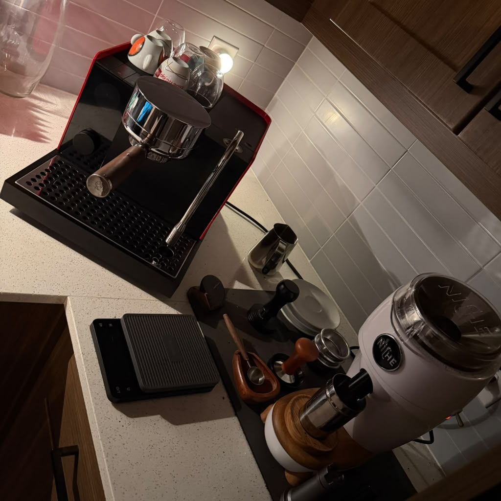

```{=html}
<div class="page-home">

  <!-- ── Profile rail ── -->
  <aside class="home-rail" aria-labelledby="home-name">
    <div class="home-profile reveal">
    
    <h1 id="home-name" class="header-name">Giuseppe Peressotti</h1>
    <p class="header-subtitle">PhD Candidate in Public Policy &amp; Political Economy · Expected Spring 2027</p>
    <p class="header-institution">The University of Texas at Dallas</p>
    <span class="header-market">On the 2026–2027 Job Market</span>

    <div class="header-links">
      <a href="mailto:Giuseppe.Peressotti@utdallas.edu">
        <svg viewBox="0 0 16 16" fill="currentColor"><path d="M.05 3.555A2 2 0 0 1 2 2h12a2 2 0 0 1 1.95 1.555L8 8.414.05 3.555ZM0 4.697v7.104l5.803-3.558L0 4.697ZM6.761 8.83l-6.57 4.027A2 2 0 0 0 2 14h12a2 2 0 0 0 1.808-1.144l-6.57-4.027L8 9.586l-1.239-.757Zm3.436-.586L16 11.801V4.697l-5.803 3.546Z"/></svg>
        Email
      </a>
      <a href="https://scholar.google.com/citations?user=qdYq504AAAAJ&hl=en&oi=ao" target="_blank" rel="noopener">
        <svg viewBox="0 0 16 16" fill="currentColor"><path d="M8.211 2.047a.5.5 0 0 0-.422 0l-7.5 3.5a.5.5 0 0 0 .025.917l7.5 3a.5.5 0 0 0 .372 0L14 7.14V13a1 1 0 0 0-1 1v2h3v-2a1 1 0 0 0-1-1V6.739l.686-.275a.5.5 0 0 0 .025-.917l-7.5-3.5Z"/><path d="M4.176 9.032a.5.5 0 0 0-.656.327l-.5 1.7a.5.5 0 0 0 .294.605l4.5 1.8a.5.5 0 0 0 .372 0l4.5-1.8a.5.5 0 0 0 .294-.605l-.5-1.7a.5.5 0 0 0-.656-.327L8 10.466 4.176 9.032Z"/></svg>
        Scholar
      </a>
      <a href="https://github.com/GiuseppePeressotti" target="_blank" rel="noopener">
        <svg viewBox="0 0 16 16" fill="currentColor" aria-hidden="true"><path d="M8 0C3.58 0 0 3.64 0 8.13c0 3.59 2.29 6.64 5.47 7.72.4.08.55-.18.55-.39 0-.19-.01-.83-.01-1.51-2.01.38-2.53-.5-2.69-.96-.09-.23-.48-.96-.82-1.15-.28-.15-.68-.53-.01-.54.63-.01 1.08.59 1.23.83.72 1.23 1.87.88 2.33.67.07-.53.28-.88.51-1.08-1.78-.21-3.64-.9-3.64-4.02 0-.89.31-1.62.82-2.19-.08-.2-.36-1.04.08-2.16 0 0 .67-.22 2.2.84A7.46 7.46 0 0 1 8 3.94c.68 0 1.36.09 2 .27 1.53-1.06 2.2-.84 2.2-.84.44 1.12.16 1.96.08 2.16.51.57.82 1.3.82 2.19 0 3.13-1.87 3.81-3.65 4.02.29.25.54.74.54 1.5 0 1.08-.01 1.95-.01 2.22 0 .21.15.47.55.39A8.14 8.14 0 0 0 16 8.13C16 3.64 12.42 0 8 0Z"/></svg>
        GitHub
      </a>
      <a href="https://www.linkedin.com/in/giuseppe-peressotti-57b6a614b/" target="_blank" rel="noopener">
        <svg viewBox="0 0 16 16" fill="currentColor"><path d="M0 1.146C0 .513.526 0 1.175 0h13.65C15.474 0 16 .513 16 1.146v13.708c0 .633-.526 1.146-1.175 1.146H1.175C.526 16 0 15.487 0 14.854V1.146zm4.943 12.248V6.169H2.542v7.225h2.401zm-1.2-8.212c.837 0 1.358-.554 1.358-1.248-.015-.709-.52-1.248-1.342-1.248-.822 0-1.359.54-1.359 1.248 0 .694.521 1.248 1.327 1.248h.016zm4.908 8.212V9.359c0-.216.016-.432.08-.586.173-.431.568-.878 1.232-.878.869 0 1.216.662 1.216 1.634v3.865h2.401V9.25c0-2.22-1.184-3.252-2.764-3.252-1.274 0-1.845.7-2.165 1.193v.025h-.016a5.54 5.54 0 0 1 .016-.025V6.169h-2.4c.03.678 0 7.225 0 7.225h2.4z"/></svg>
        LinkedIn
      </a>
    </div>
    </div>
  </aside>

  <main class="content">

    <!-- About -->
    <section class="section reveal">
      <div class="section-label">About</div>
      <div class="about-text">
        <p>Hi there and welcome! I'm <strong>Giuseppe Peressotti</strong>, a PhD Candidate in Public Policy and Political Economy at the <strong>University of Texas at Dallas</strong>. I'm currently on the 2026&ndash;2027 academic job market and expect to graduate in Spring 2027.</p>
        <p>I define myself primarily as an <strong>International Political Economy scholar</strong>, with my main research sitting at the intersection of <strong>trade policy and digital governance</strong>. My dissertation, <em>Digital Governance Rulemaking Through Trade Policy: Drivers and Effects of Digital Provisions in PTAs</em>, studies how governments use trade agreements to build rules for the digital economy: why particular digital provisions emerge, how they spread across agreements and countries, and what happens once those international commitments are set.</p>
        <p>Beyond my dissertation, my research engages with broader questions on how states cooperate, compete, and position themselves in the international system. I am working on projects examining trade negotiations, geopolitical alignment, and the institutional choices governments make in pursuing economic and political objectives, as well as a broader strand of research on political conflict, civil resistance, and democratic transitions. So far, my work has appeared in the <em>European Journal of International Relations</em> and the <em>Journal of Peace Research</em>, with additional WIP projects across my various areas of interest.</p>
        <p>At UT Dallas, I am also affiliated with the <a href="https://pinckney-lab.netlify.app/" target="_blank" rel="noopener"><strong>Pinckney Research Lab</strong></a> <em>(a new name might be forthcoming)</em>, where I have contributed to projects examining the organizations that shape democratic transitions and, more recently, why actors supporting authoritarian and backsliding governments sometimes defect during periods of mass mobilization.</p>
        <p>If you are a graduate student or early career scholar working in IPE, you should also check out <a href="https://gsipe-workshop.github.io/" target="_blank" rel="noopener"><strong>GSIPE &mdash; the Graduate Students in International Political Economy Workshop</strong></a>. GSIPE is a virtual, graduate-student-run workshop series featuring research presentations, professional-development events, and other opportunities for junior scholars to share their work, receive feedback, and connect with other graduate students working in international political economy. Don't forget to subscribe to our newsletter!</p>
        <figure class="espresso-figure">
          
          <figcaption>Pictured, my beautiful espresso setup: a Fellow ES 1 and a Niche Duo.</figcaption>
        </figure>
        <p>Outside academia, I spend an arguably unreasonable amount of time thinking about <strong>coffee and espresso</strong>, enjoy lifting weights, and try to travel, hike, and get outdoors whenever I can. Lately, I have also found myself falling down a rabbit hole of quality backpacks. Feel free to look around, check out my research and teaching, or get in touch!</p>
      </div>
    </section>

  </main>
</div>

<footer>
  <p class="footer-text"><a class="pub-link" href="mailto:Giuseppe.Peressotti@utdallas.edu">Contact me</a> &middot; &copy; 2026 Giuseppe Peressotti</p>
</footer>
```
